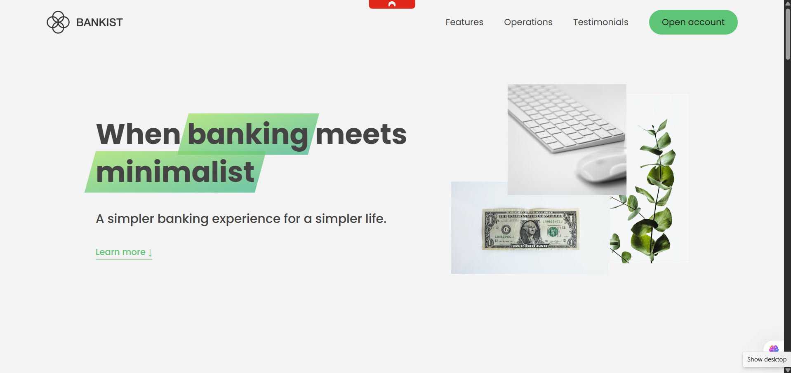

# 🏦 Bankist – When Banking Meets Minimalist

A modern, interactive, and visually elegant landing page for a fictional digital bank. This project demonstrates advanced JavaScript features, dynamic UI components, and modern frontend design principles using only **HTML**, **CSS**, and **Vanilla JavaScript**.

## 📸 Screenshots

---

## ✨ Features

- 💬 Modal window for opening an account
- 🧭 Smooth scrolling navigation
- 🔄 Tabbed operations (Transfers, Loans, Closing)
- 📌 Sticky navigation using Intersection Observer API
- 🎯 Section reveal animations on scroll
- ⏳ Lazy-loaded images for better performance
- 🧭 Fully functional image slider/testimonial carousel
- 🖼 Responsive structure (can be improved further)
- 🔧 Clean, scalable Vanilla JS architecture

---

## 🛠 Tech Stack

- **HTML5** – Semantic, accessible structure
- **CSS3** – Grid/Flexbox layout, custom properties (variables), responsive utilities
- **JavaScript (ES6+)** – DOM manipulation, events, Intersection Observer API, scrollIntoView, event delegation

---

## 📚 Learning Objectives

This project is great for:

- Practicing DOM manipulation and event handling
- Understanding event propagation and delegation
- Using the Intersection Observer API for interactivity
- Building UI/UX features without libraries or frameworks
- Lazy-loading images for better performance
- Structuring code cleanly with modular practices
